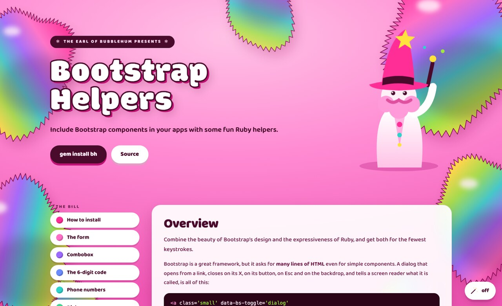

# Bh · Bootstrap Helpers

**Bootstrap 6 in a Rails app, with the markup already written.**

[](https://claudiob.github.io/bh/)

<p align='center'>
  <a href='https://claudiob.github.io/bh/'><strong>Every component, drawn and explained&nbsp;→</strong></a>
</p>

Bootstrap is a fine framework that asks for a lot of HTML. Bh answers with a form builder that
dresses every field a page can ask for, helpers for the components Bootstrap ships behavior for
and no markup — a combobox, a 6-digit code, a dialog, a toast, a thread of messages — and the
one stylesheet and one script that carry them, served by the engine.

## How to install

```bash
gem install bh
```

```ruby
# Gemfile
gem 'bh', '~> 6.3.0'
```

`~> 6.3.0` stops short of `6.4`, and that is the pin to hold: **until this line settles it
breaks on a minor, not on a major.** Rails 8.1 and Ruby 3.2 are the minimum.

6.2.0 breaks everything before it and keeps its major anyway. 6.0 through 6.1.4 were an alpha
in everything but the number — Bootstrap 3 wrappers with a Bootstrap 6 stopgap bolted on, cut
while Bootstrap 6 was itself pre-release — so there was no settled API to break. Those numbers
are taken and cannot be withdrawn, RubyGems keeping anything published over thirty days ago, so
this release steps over them.

With the gem in the bundle an app serves `/bh/css/bh.css` and `/bh/js/bh.js` itself. One helper
puts both in the head, along with everything Bootstrap and Turbo read:

```erb
<%= bh_head_tags %>
```

## The palettes

Nine of them, served at `/bh/theme/<name>.css` and linked one at a time, after the stylesheet:
`bootstrap`, `dawn`, `dracula`, `gruvbox`, `monokai`, `nord`, `one_dark`, `solarized`,
`tokyo_night`. Each restates all thirteen steps of every Bootstrap family it repaints, plus
`--bs-white`, `--bs-black` and the three text tones. Every accent clears 3:1 against its label
and every text tone 4:1, in both modes.

`bootstrap` declares nothing: upstream's palette comes back by dropping the others' block
rather than by writing one, and it is named so a toggle can reach it — a reader who rotates
through nine and never finds the one the pages started in has been shown a door with no handle
on the inside.

The `scheme` controller does the swapping, and the choice belongs to the reader:

```erb
<button type='button' data-controller='scheme' data-action='scheme#rotate'
        data-scheme-themes-value='["bootstrap","dawn","dracula","gruvbox","monokai","nord","one_dark","solarized","tokyo_night"]'
        data-scheme-path-value='/bh/theme' data-scheme-storage-value='scheme'>
  Another palette
</button>
```

A click moves to another palette and into the mode it is not in. Put the stored choice back
before the first paint, from the layout's own script: a controller connects far too late for
that, and the page would otherwise flash the palette the server chose.

## What you get

```ruby
class ApplicationController < ActionController::Base
  default_form_builder Bh::FormBuilder
end
```

| | |
| --- | --- |
| `fieldset` `label` `submit` `button` | the form's furniture, with the pill Bootstrap draws |
| every `*_field`, `text_area`, `select`, `check` | dressed at one size, so a view says which kind and nothing about how it looks |
| `phone_field` | a North American number, shaped `555-555-5555` as it is typed |
| `pin_field` | one real field drawn as six slots, offered by the phone from the text that brought it |
| `combobox` | a `<select>` drawn as a searchable menu, still the one thing the form submits |
| `dialog` | a link and the `<dialog>` it opens, sharing an id made from the link's own words |
| `notices` | the flash as toasts, held while they are read |
| `chat_with` | a thread of bubbles, and the field that posts the next one |
| `flow` | the page of a signup flow: a header, a title, one card, a footer |
| 22 Stimulus controllers | registered by the bundle, called by `data-controller` |
| 9 palettes | served at `/bh/theme/`, swapped by the `scheme` controller |

The page above draws every one of them beside the line of Ruby that produces it.

## Trying it out

The gem carries a dummy app drawing every helper on one page, and a `bin/rails` at the root, so
there is no `cd` first. From the root of a clone:

```bash
bin/setup
rails s
```

`localhost:3000` is every component at once, `?flash=1` adds the toasts, and `/flow` is the
signup page.

## Elsewhere

- [The page](https://claudiob.github.io/bh/) — every component, and how to reach it
- [API reference](https://rubydoc.info/gems/bh) — built from what RubyGems holds
- [CHANGELOG](CHANGELOG.md) — what each release is, and which of the three it is

MIT licensed. Drawn for [houseaccount](https://houseaccount.com/) by the Earl of Bubblehum.
